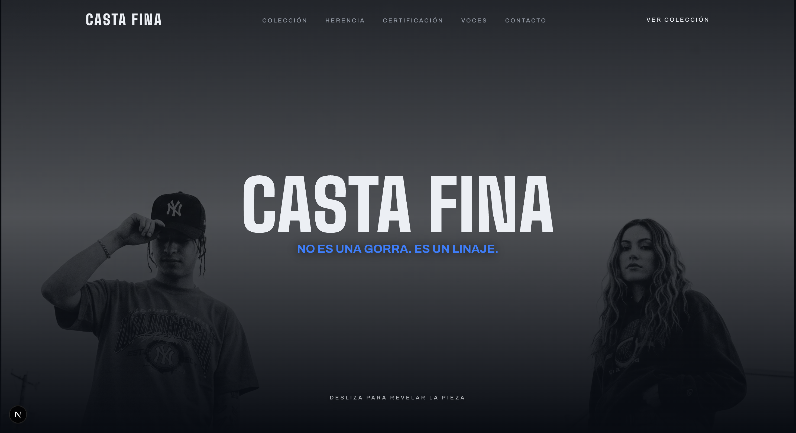
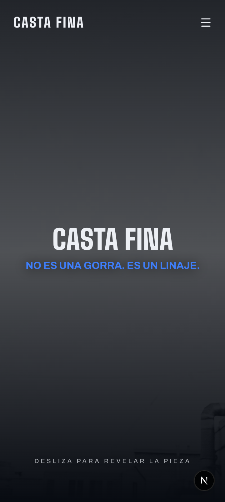

<div align="center">

# CASTA FINA

**Limited-run caps, certified piece by piece.**
Urban heritage, fine craftsmanship.


</div>

<br />

## Preview

<div align="center">

### Desktop



<br /><br />

### Mobile



</div>

<br />

## About the project

Casta Fina is a single-page site built for a limited-run streetwear cap brand. The design concept borrows the language of certificates of authenticity and provenance books — serial numbers, warranties, numbered pieces — and applies it to a dark urban aesthetic.

### Features

- **Interactive scroll hero** — the featured piece appears and grows as the user scrolls or swipes, with the title and subtitle fading during the transition.
- **Catalog** — product grid with real photography, piece numbering, and collection line.
- **Heritage / Process certificate** — editorial section with the manufacturing steps.
- **Certification** — *bento*-style grid with an interactive glow effect on the border (follows the cursor).
- **Voices** — testimonial carousel with auto-advance, arrows (desktop), and swipe (mobile).
- **Waitlist + WhatsApp** — contact form and direct link to WhatsApp.
- **Functional single-page navigation** — smooth-scroll anchors that account for header height; mobile side menu with a blurred background.
- **Fully responsive** — from mobile to desktop, with fluid typography and layouts that rearrange, not just shrink.

### Tech stack

| Category | Technology |
|---|---|
| Framework | [Next.js 16](https://nextjs.org) (App Router, Turbopack) |
| Language | TypeScript |
| Styling | Tailwind CSS v4 |
| Animation | Framer Motion |
| Components | shadcn/ui convention (`components/ui`) |
| Icons | lucide-react |
| Typography | Big Shoulders (display) + Archivo (text) via `next/font` |

<br />

## Getting started

```bash
npm install
npm run dev
```

Open [http://localhost:3000](http://localhost:3000) in your browser.

Other available commands:

```bash
npm run build   # build de producción
npm run start   # sirve el build de producción
npm run lint    # revisa el código con ESLint
```

<br />

## Project structure

```
app/
  layout.tsx        # fuentes, metadata, layout raíz
  page.tsx           # orden de las secciones de la página
  globals.css        # tema de color (oklch), radios, utilidades

components/
  site/              # una sección de la página por archivo
  blocks/            # componentes interactivos más complejos (hero)
  ui/                # primitivos reutilizables (botón, glow effect)

lib/
  products.ts        # catálogo — agrega/edita piezas aquí
  config.ts          # número de WhatsApp y mensaje predefinido

public/
  *.jpeg / *.png     # fotografía de producto y assets del sitio
```

<br />

## Customization

- **Catalog**: edit the array in `lib/products.ts` (name, line, price, image, alt).
- **WhatsApp**: change the number and message in `lib/config.ts`.
- **Colors**: the palette (background, *cobalt* accent, *oxblood* accent) lives as `oklch()` variables in `app/globals.css`.
- **Copy**: each section is a standalone component in `components/site/`, with the text directly in the JSX.
</content>
</invoke>
